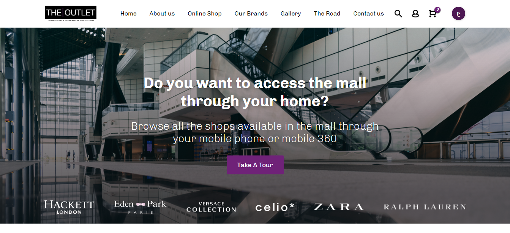

# The Outlet (Home Page)

## About The Project
* A freelance project to design the web page of ***THE OUTLET***.
* The page is free of functionalities with only the main thing is to create the UI of the page which some elements were extracted from a PSD file created by [NASNAV](https://www.nasnav.com/).
* You must refresh the page to allow the [Slick Carousel](http://kenwheeler.github.io/slick/) library on different sizes of the layout.
* Here you can watch the live [Demo](https://malakjoseph.github.io/outlet-pages-home/).

## Credits
* [FontAwesome](https://fontawesome.com/)
* [Slick Carousel](http://kenwheeler.github.io/slick/)

## License
This project is licensed under the terms of the MIT license.
